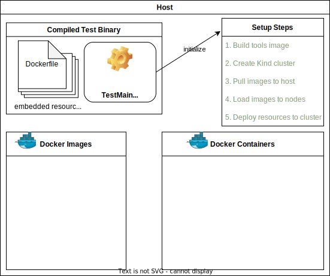
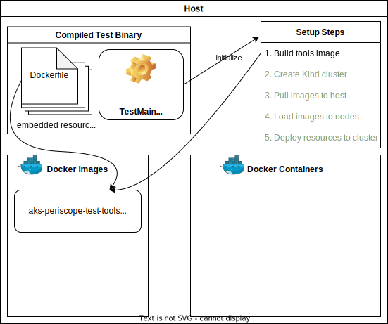
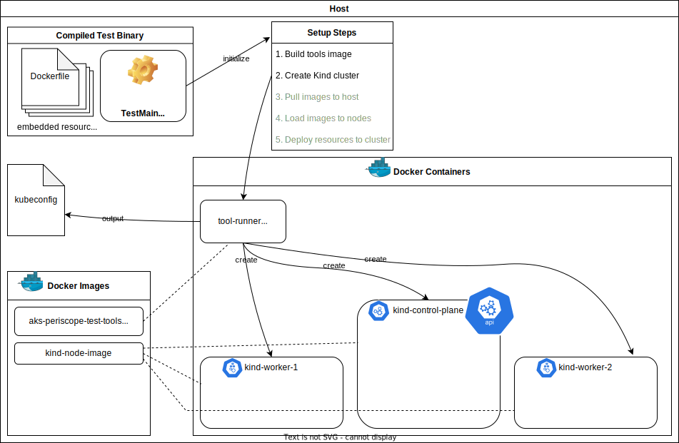
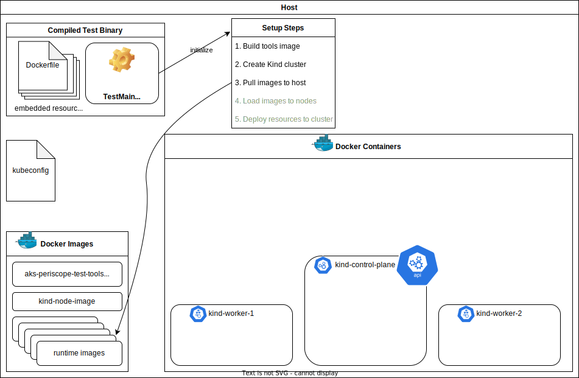
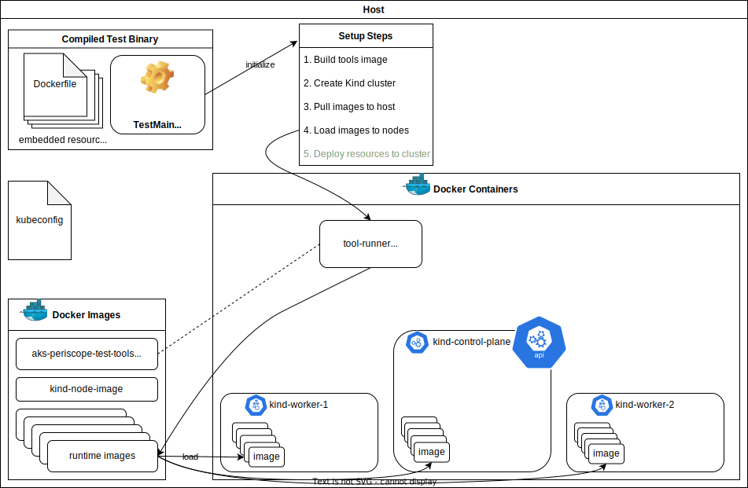

# Testing

The `collector` package tests are run against a [Kind](https://kind.sigs.k8s.io/) cluster.

The cluster is created on the fly by the test initialization code. This gives some background on how the setup happens.

## Requirements

The only tools required on the host (development machine or CI agent) are Docker and Go.

## Launching the tests

The tests are launched using `go test ./...`, or by launching a debugger (F5) in VS Code while any file in the `collector` package is active.

This produces a binary which runs on the host, containing some embedded resources and the initialization code (the `TestMain` function in `collector/shared_test.go`).

At this point the state of the host machine will look like this:

The initialization code is in the `test` package, so `TestMain` will call out to the `test.ClusterFixture` type, which is responsible for building the cluster and all other shared test dependencies.

The following shows the steps `ClusterFixture.GetClusterFixture()` goes through to initialize the cluster.

### Step 1: Building the `tools` image

The first step is to use the Docker client API to build an image containing all the tools and resources needed to set up the cluster. This includes `kind`, `kubectl`, `yaml` resource definitions, and any other tools that might be useful for running setup commands, like `helm` and `osm`.

The Dockerfile and resources to be copied to this image are under `test/resources`, and are compiled into the binary and retrieved using [go:embed](https://pkg.go.dev/embed).

### Step 2: Creating the cluster

Now we have a local Docker image with all our tools on it, we can use the Docker client API to run it as a container. This will happen several times, but in this instance it runs commands to:
1. create a cluster (if it doesn't already exist) with a specific name so it doesn't clash with other `kind` clusters on the host.
2. export the cluster's `kubeconfig` to stdout.

This results in a cluster with three nodes (running as Docker containers, whose images will be stored in the host Docker image cache).

> Technical details:
>  - We're invoking Docker commands from inside the tools container, so we need to bind `/var/run/docker.sock` from the host.
>  - We'll be accessing the APIServer IP/port from both the container and host, so we need to create the tools container using `host` networking.

The test code then reads the `kubeconfig`, which can be used in memory to invoke `client-go` commands, and also saved to a temp file to be bind-mounted into instances of the tools container later on.

### Step 3: Pulling Docker images

We now go through *all* Docker images that we expect to be used by pods in the cluster, and pull every one to the host.

This step is functionally not necessary, and actually incurs a performance penalty the first time it is run.

The reason for doing it is to optimize initialization time when performing repeated test runs in a development environment. After the first run, startup time is significantly improved, as explained in the next step.

### Step 4: Loading images to nodes

This is part of the performance optimization for local development/debugging test runs from the previous step.

All the images that were just pulled to the host are now loaded onto the nodes. Without this, any pods running on those nodes will pull their images from remote registries. This happens even though the exact same images exist in the host's Docker image store (because the nodes use `crictl`/`containerd` and have no visibility into the Docker environment they're running in).

Having done this, pods in the cluster start much faster after they are created.

### Step 5: Deploying resources to the cluster

We now have a running cluster, a `kubeconfig` file for it, and a Docker image containing whatever tools we might want to deploy resources to the cluster, as well as any resource definitions and Helm charts we might want to deploy.

This allows us to repeatedly launch our tools container to install any Kubernetes resources on our cluster that might be required for testing purposes.

Any pods that are launched will use the local images on the nodes themselves, rather than downloading from remote registries.

## Cleanup

It's not possible (or desirable) to reliably clean up all the resources and the cluster itself after every test run.

For CI workflows, cleanup is unnecessary because that is managed by the provider. For local test runs, the goal is to leave the system in a state that allows each test run to be consistent and reproducible, while being as fast as possible to initialize.

With that in mind, we:
- intentionally *retain* the cluster and the cached Docker images (both within the nodes and the host) after completing the test run.
- delete any Kubernetes resources deployed to the cluster (after completing the test run, and before starting a new one in case the previous run terminated unexpectedly).

## Cached image validation

Managing the list of images that need to be pre-pulled and loaded into the nodes could be a huge maintenance overhead if we have to manually review all the resources deployed to the cluster.

For that reason we automatically check the images that are loaded on the nodes after each test run. If any unexpected images are found they are logged and the test run will fail. Similarly, if any images that we *expect* to be there are *not* found, they are also flagged (because it suggests our list includes images which are no longer used).

There is also a check to try and ensure that no pods deployed for testing purposes use the image pull policy `Always`, since that would result in unnecessary pulling of images we're trying to guarantee will already be available.
